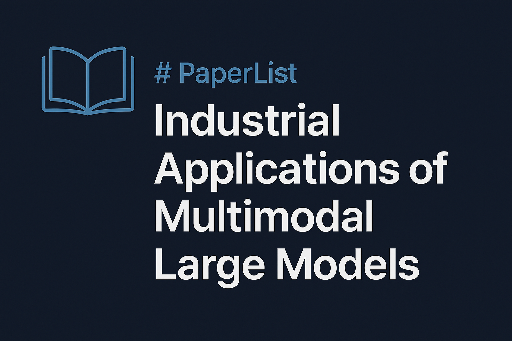

# 📚 PaperList: Industrial Applications of Multimodal Large  Language Models

A curated list of key papers on the industrial applications of multimodal large models, covering surveys, fine-tuning approaches, RAG-based systems, and more.

---

## 📑 Table of Contents

- [📊 Benchmark](#-benchmark)
- [📖 Survey Papers](#-survey-papers)
- [🔧 SFT-based Industrial MLLMs](#-sft-based-industrial-mllms)
- [🔍 RAG-based Industrial MLLMs](#-rag-based-industrial-mllms)
- [📌 Other Relevant Resources](#-other-relevant-resources)
- [🤝 Contributing](#-contributing)

---

## 📊 Benchmark

- [Zero-Shot Learning in Industrial Scenarios: New Large-Scale Benchmark, Challenges and Baseline](https://ojs.aaai.org/index.php/AAAI/article/view/33124)  
  *Application/Task*: Zero-Shot Learning,  Industrial Defect Detection  
  *Journal/Conference*: AAAI 2025 (CCF-A)

  - [ChatTS: Aligning Time Series with LLMs via Synthetic Data for Enhanced Understanding and Reasoning](https://arxiv.org/abs/2412.03104)  
  *Application/Task*: Understanding and Reasoning of Time Series  
  *Journal/Conference*: Preprint

## 📖 Survey Papers

- [Foundation Models for the Process Industry: Challenges and Opportunities](https://www.sciencedirect.com/science/article/pii/S2095809925001766)  
  *Application/Task*: Process Industry  
  *Journal/Conference*: Engineering (IF=10.1) 
 
- [A survey on potentials, pathways and challenges of large language models in new-generation intelligent manufacturing](https://www.sciencedirect.com/science/article/pii/S0736584524001704)  
  *Application/Task*: Intelligent Manufacture  
  *Journal/Conference*: Robotics and Computer-Integrated Manufacturing (IF=9.1)  

- [工业大模型: 体系架构、关键技术与典型应用](http://scis.scichina.com/cn/2024/SSI-2024-0185.pdf)  
  *Application/Task*: Industrial  
  *Journal/Conference*: 中国科学 : 信息科学 (IF=7.3)  
  
- [ChatGPT-Like Large-Scale Foundation Models for Prognostics and Health Management: A Survey and Roadmaps](https://www.sciencedirect.com/science/article/pii/S0951832023007640)  
  *Application/Task*: Health Management  
  *Journal/Conference*: Reliability Engineering & System Safety (IF=9.4)  

- [An Outline of Prognostics and Health Management Large Model:Concepts, Paradigms, and Challenges](https://www.sciencedirect.com/science/article/pii/S088832702500384X)  
  *Application/Task*: Prognostics and Health Management  
  *Journal/Conference*: Mechanical Systems and Signal Processing (IF=7.9)  

  
---

## 🔧 SFT-based Industrial MLLMs

- [AnomalyGPT: Detecting Industrial Anomalies using Large Vision-Language Models](https://ojs.aaai.org/index.php/AAAI/article/view/27963)  
  *Application/Task*: Anomaly Detection  
  *Journal/Conference*: AAAI 2024 (CCF-A)

- [FaultGPT: Industrial Fault Diagnosis Question Answering System by Vision Language Models](https://arxiv.org/abs/2502.15481)  
  *Application/Task*: Fault Diagnosis  
  *Journal/Conference*: Preprint

- [StictionGPT: Detecting Valve Stiction in Process Control Loops using Large Vision Language Model](https://dx.doi.org/10.2139/ssrn.5265092)  
  *Application/Task*: Process Industry, Stiction Detection  
  *Journal/Conference*: Preprint

- [AAD-LLM: Adaptive Anomaly Detection Using Large Language Models](https://ieeexplore.ieee.org/abstract/document/10825679/)  
  *Application/Task*: Anomaly Detection  
  *Journal/Conference*: IEEE BigData (CCF-C)

- [面向旋转机械装备的智能故障诊断通用基础模型研究](https://kns.cnki.net/kcms2/article/abstract?v=X7jC3qydZ5-_SOa3t98F1Fgwhq-54UDkVaBXA_PkataWKlLsM4R1_-6TJGPXHlEIFqJQjRhuzhoslrnBxa0v6RpLrioDKVAVjVBl1r8BS51L2hCZlM1nrBc16W_tfzoJH_WamkqFWDALB3KjbwfupTnwDdmIczDkov5xiLo1WH4UFEoN79wucQ==&uniplatform=NZKPT&language=CHS)  
  *Application/Task*: Mechanical Fault Diagnosis  
  *Journal/Conference*: 西安交通大学学报 (IF=1.8)  

- [面向机械设备通用健康管理的智能运维大模型](https://qikan.cmes.org/jxgcxb/CN/10.3901/JME.2025.06.001)  
  *Application/Task*: Health Management  
  *Journal/Conference*: 机械工程学报 (IF=4.3)  
  
- [Pre-Trained Large Language Model Based Remaining Useful Life Transfer Prediction of Bearing](https://arxiv.org/abs/2501.07191)  
  *Application/Task*: Bearing RUL Prediction  
  *Journal/Conference*: Preprint

- [Leveraging large self-supervised time-series models for transferable diagnosis in cross-aircraft type Bleed Air System](https://www.sciencedirect.com/science/article/pii/S1474034625001685)  
  *Application/Task*: Aircraft, Time-Series Diagnosis  
  *Journal/Conference*: Advanced Engineering Informatics (IF=8.0)  

- [Large-Scale Visual Language Model Boosted by Contrast Domain Adaptation for Intelligent Industrial Visual Monitoring](https://ieeexplore.ieee.org/abstract/document/10666846/)  
  *Application/Task*: Industrial Visual Monitoring  
  *Journal/Conference*: IEEE Transactions on Industrial Informatics (IF=2.8) 

- [FaultExplainer: Leveraging Large Language Models for Interpretable Fault Detection and Diagnosis](https://www.sciencedirect.com/science/article/pii/S0098135425001565)  
  *Application/Task*: Fault Diagnosis  
   *Journal/Conference*: Computers & Chemical Engineering (IF=3.9) 

- [LLM-based framework for bearing fault diagnosis](https://www.sciencedirect.com/science/article/pii/S0888327024010252)  
  *Application/Task*: Bearing Diagnosis  
  *Journal/Conference*: Mechanical Systems and Signal Processing (IF=7.9) 

- [Multimodal Large Language Model-Based Fault Detection and Diagnosis in Context of Industry 4.0](https://www.mdpi.com/2079-9292/13/24/4912)  
  *Application/Task*: Fault Detection  
   *Journal/Conference*: Electronics (IF=2.6) 

- [Leveraging Vision Foundation Model via PConv-Based Fine-Tuning with Automated Prompter for Defect Segmentation](https://www.mdpi.com/1424-8220/25/8/2417)  
  *Application/Task*: Defect Segmentation  
  *Journal/Conference*: Sensors (IF=3.4)

- [基于大模型的设备故障知识图谱自动构建方法](http://www.c-a-m.org.cn/CN/10.3969/j.issn.1006-2475.2024.11.008)  
 *Application/Task*: Automatic Construction of Equipment Failure Knowledge Graphs  
 *Journal/Conference*: 计算机与现代化

- [Generalized domain prompt learning for accessible scientific vision-language models](https://www.sciencedirect.com/science/article/pii/S2950160125000166)  
  *Application/Task*: Multiple scientific fields (such as remote sensing, medical imaging, geology, fluid mechanics, etc.)  
  *Journal/Conference*: Nexus （Cell Press）

- [DiagLLM: multimodal reasoning with large language model for explainable bearing fault diagnosis](https://link.springer.com/article/10.1007/s11432-024-4333-7)  
  *Application/Task*: Bearing fault diagnosis    
  *Journal/Conference*: Science China Information Sciences (IF=7.3)

  
---

## 🔍 RAG-based Industrial MLLMs

- [TIMERAG: BOOSTING LLM TIME SERIES FORECASTING VIA RETRIEVAL-AUGMENTED GENERATION](https://ieeexplore.ieee.org/abstract/document/10889933/)  
  *Application/Task*: Time-Series Forecasting  
   *Journal/Conference*: ICASSP 2025 (CCF-B) 

- [TIMERAF: RETRIEVAL-AUGMENTED FOUNDATION MODEL FOR ZERO-SHOT TIME SERIES FORECASTING](https://arxiv.org/abs/2412.20810)  
  *Application/Task*: Time-Series Forecasting  
  *Journal/Conference*: Preprint

- [RAAD-LLM: Adaptive Anomaly Detection Using LLMs and RAG Integration](https://arxiv.org/abs/2503.02800)  
  *Application/Task*: Anomaly Detection  
  *Journal/Conference*: Preprint  
  

- [LLM-R: A Framework for Domain-Adaptive Maintenance Scheme Generation Combining Hierarchical Agents and RAG](https://arxiv.org/abs/2411.04476)  
  *Application/Task*: Maintenance Scheme  
  *Journal/Conference*: Preprint

- [Multimodal RAG-driven Anomaly Detection and Classification in Laser Powder Bed Fusion using Large Language Models](https://arxiv.org/abs/2505.13828)  
  *Application/Task*: Anomaly Detection and Classification, Additive Manufacturing (3D Printing)  
  *Journal/Conference*: Preprint

- [Empowering LLMs by hybrid retrieval-augmented generation for domain-centric Q&A in smart manufacturing](https://www.sciencedirect.com/science/article/pii/S1474034625001053)  
  *Application/Task*: Smart Manufacturing  
   *Journal/Conference*: Advanced Engineering Informatics (IF=8.0) 

- [Improving knowledge management in building engineering with hybrid retrieval-augmented generation framework](https://www.sciencedirect.com/science/article/pii/S2352710225004255)  
  *Application/Task*: Building Engineering  
   *Journal/Conference*: Journal of Building Engineering (IF=6.7) 

- [Beyond Text: Optimizing RAG with Multimodal Inputs for Industrial Applications](https://arxiv.org/abs/2410.21943)  
  *Application/Task*: Smart Manufacturing  
  *Journal/Conference*: Preprint

  
---

## 📌 Other Relevant Resources

- [Awesome-LLM-RAG-Application](https://github.com/lizhe2004/Awesome-LLM-RAG-Application)  

---

## 🤝 Contributing

Feel free to submit a pull request to add more papers or resources!

